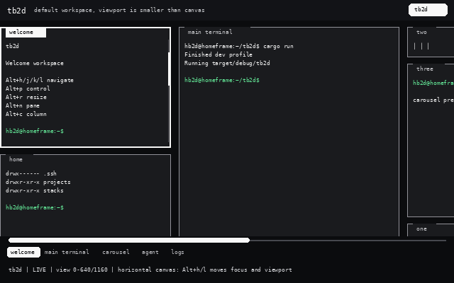

# tb2d

[](https://github.com/hb2d87/tb2d/actions/workflows/ci.yml)
[](https://github.com/hb2d87/tb2d/actions/workflows/release.yml)
[](LICENSE)

tb2d is a Rust terminal workspace manager with a horizontally scrollable strip
of columns and PTY-backed panes. Each column can choose a pane layout mode:
`fit` for stacked panes or `carousel` for a focused, zellij-like vertical view.

It is built for terminal workspaces that need more spatial memory than a stack
of tabs: keep a pane, shell, code assistant, logs, and focused tool
output in one sliding canvas.

Status: tb2d is currently a draft-stage project. It was developed with heavy
LLM assistance, so expect fast iteration, active reshaping of UX details, and
rough edges that should be validated before depending on it for critical work.

Highlights:

- PTY-backed panes with ANSI color, common text attributes, and wide-character
  rendering.
- Runtime control mode for pane zoom, new panes/columns, resizing, movement,
  layout changes, and manual saves.
- Named sessions with autosave, restored runtime workspace shape, per-pane
  scroll state, diagnostics, and panic logs.
- A curl-based installer for Linux x86_64 and Apple Silicon macOS.

See [CHANGELOG.md](CHANGELOG.md) for release notes and [LICENSE](LICENSE) for
license terms.

## Flow



## Install

Install the latest release with one command:

```bash
curl -fsSL https://raw.githubusercontent.com/hb2d87/tb2d/master/scripts/install.sh | sh
```

The installer puts `tb2d` in `~/.local/bin`, adds that directory to your shell
profile if needed, and installs starter YAML configs to
`${XDG_CONFIG_HOME:-$HOME/.config}/tb2d` without overwriting edits.

Open a new terminal after install, then run:

```bash
tb2d
```

Update later by running the same install command again.

Remove the app:

```bash
rm -f ~/.local/bin/tb2d
```

Your editable config and saved sessions live under `~/.config/tb2d` and your
platform state directory. Keep those if you want to reinstall later.

## Run

No flags are required:

```bash
tb2d
```

The default view is `2r, 1r, 3rc, 2r`: two stacked welcome panes, one main
terminal pane, a three-pane carousel column, and two stacked agent panes.

Open your editable default YAML config:

```bash
tb2d --config
```

This creates `${XDG_CONFIG_HOME:-$HOME/.config}/tb2d/default.yaml` from the
built-in default if it does not exist, then opens it in `$VISUAL`, `$EDITOR`,
or `vi`. To print the path without opening an editor:

```bash
tb2d --config-path
```

Start or replace a named session with a YAML workspace template:

```bash
tb2d --template ./examples/web-reader.yaml --session main
```

Later, restore that session and its remembered template with:

```bash
tb2d --session main
```

## Controls

Use `Alt+h/j/k/l` or `Alt+Arrow` to change focus, and click a pane to focus it.
The viewport eases into focus changes instead of jumping abruptly. Press
`Ctrl+q` to exit. Press `Alt+p` to open control mode, a small in-app cheat
sheet for navigation, structure, layout, and session actions. Press `Alt+r`
to enter resize mode directly.

Column controls:

- `Alt+h/l` or `Alt+Left/Right` moves between columns.
- `Alt+-` and `Alt+=` resize the focused column.
- `Alt+0` returns the focused column to its configured width.
- `Alt+m` cycles `fit`, `tabs`, and `carousel` layouts for the focused column.
- `Alt+c` creates a column after the focused column.
- `Alt+s` saves the current session immediately.

Pane controls:

- `Alt+j/k` or `Alt+Down/Up` moves between panes in the focused column.
- `Alt+z` zooms the focused pane to the full viewport; press it again to
  restore the layout.
- `Alt+PageUp` / `Alt+PageDown` or the mouse wheel scrolls the focused pane
  vertically.
- `Alt+Shift+h/l`, `Alt+Shift+Left/Right`, or horizontal wheel events scroll
  it horizontally.
- `Alt+w` cycles `symbols`, `words`, and `horizontal` content presentation.
- `Alt+n` creates a pane after the focused pane.
- `Alt+Shift+k/j` or `Alt+Shift+Up/Down` reorders the focused pane within its column.

Control mode:

- `h/j/k/l` or arrows moves focus.
- `z` toggles pane zoom.
- `n` creates a pane after the focused pane.
- `c` creates a column after the focused column.
- `Shift+h/l`, `[` / `]`, or `,` / `.` moves the focused pane to the previous
  or next column.
- `{` / `}` moves the focused column left or right.
- `r` enters resize mode.
- `m` cycles layout mode, and `w` cycles content presentation.
- `0` or `b` resets the focused column's space: column width, pane weights,
  and zoom.
- `s` saves the current session immediately.
- `Esc` or `p` exits control mode without applying another action.

Resize mode:

- `j`, `Down`, `+`, or `=` grows the focused pane in `fit` layout.
- `k`, `Up`, or `-` shrinks the focused pane in `fit` layout.
- `h` / `Left` shrinks the focused column, and `l` / `Right` grows it.
- `0` or `b` resets the focused column's space.
- `Esc`, `r`, or `p` exits resize mode.

`fit` is a vertical stack. `tabs` shows only the selected pane. `carousel`
shows the selected pane with compact neighboring previews. Pane selection is
remembered independently for each column.

## Sessions and diagnostics

When you run with `--session`, tb2d autosaves every 5 seconds and once more on
exit. The saved session remembers the template path, focus, viewport offset,
runtime workspace shape, column width overrides, selected pane per column,
runtime layout modes, fit pane weights, zoomed pane, and pane scroll positions.
Runtime workspace shape includes columns and panes created from control mode.
Passing a new `--template` starts from that YAML again and replaces the saved
runtime workspace snapshot on the next save.

When there is no explicit `--template` and no remembered template in the
session, tb2d uses the editable default config at
`${XDG_CONFIG_HOME:-$HOME/.config}/tb2d/default.yaml`. Existing sessions keep
their saved runtime workspace until you replace them with `--template` or edit
the saved session state.

Session state is written under the platform state directory as
`tb2d/<session>.json`. Runtime diagnostics are written next to it as
`tb2d/<session>.diagnostics.jsonl`. On most Linux systems, the default session
diagnostics file is `~/.local/state/tb2d/main.diagnostics.jsonl`.

Diagnostics are newline-delimited JSON records. They include session
start/stop breadcrumbs, workspace load failures, terminal event read/poll
errors, autosave failures, scroll bursts, frame event caps, and panic
backtraces. If the UI disappears without an obvious terminal error, check this
file first.

## Workspace YAML

Use `tb2d --config` for the quickest way to open the default YAML. Each column
has a name, width, optional `fit`, `tabs`, or `carousel` layout,
and one or more panes. Widths support cell counts, the `small`, `medium`, and
`big` presets, custom presets, and percentages with optional clamps such as
`"55% min=42 max=72"`.

Set `wrap_columns: true` to let an additional horizontal move at the first or
last column wrap to the opposite edge. Without it, horizontal navigation stops
at the edge.

The `ui.selection_bg` color is used for the selected pane border and selected
pane title background. The `ui.selection_fg` color is used for selected pane
title text. This keeps the focused pane visible without changing terminal
content colors inside the pane.

```yaml
name: demo
ui:
  accent: light-cyan
  muted: dark-gray
  selection_fg: black
  selection_bg: white
  status_fg: black
  status_bg: cyan
gap: 2
peek: 3
wrap_columns: true
columns:
  - name: editor
    layout: carousel
    width: big
    panes:
      - name: shell
        command: "${SHELL:-sh}"
```

Pane commands run through `sh -lc`, so startup commands can be embedded per
pane:

```yaml
panes:
  - name: server
    command: "cd ~/project && npm run dev"
  - name: shell
    command: "cd ~/project && git status; exec ${SHELL:-sh}"
```

End with `exec ${SHELL:-sh}` when you want the pane to stay open after a setup
command finishes.

tb2d uses PTYs with a `vt100` parser. It resizes pane terminals with the
workspace, renders ANSI colors and common text attributes, preserves wide
character layout, and handles common full-screen terminal applications. It is
still intentionally lighter than a complete terminal emulator: application
mouse forwarding, application cursor-key mode, and terminal reply plumbing are
future improvements.
